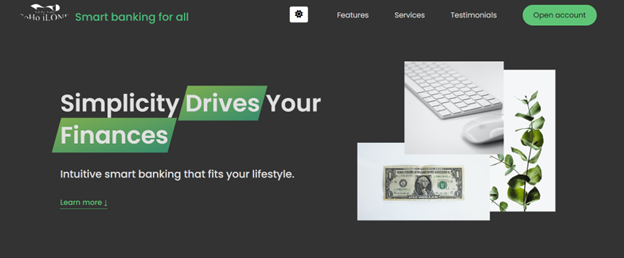

# Interactive Bank Website Demo

This project is a modern, responsive **demo of a banking website**, featuring:

- **Modal window** for displaying additional information
- **Smooth scrolling** to page sections
- **Navigation menu** with hover effects and sticky behavior on scroll
- **Tabs** to switch content within a section
- **Lazy loading images** for improved performance
- **Interactive slider** with navigation buttons and slide indicators
- **Dark mode** with persistent user preference saved in `localStorage`
- **Hamburger menu** for mobile devices



---

## Demo

Ready to test-drive the project? The demo is just [one click](https://d-vokic.github.io/Bank-Website-Demo/) away!

---

## Table of Contents

- [ Interactive Bank Website Demo](#interactive-bank-website-demo)

  - [Demo](#demo)
  - [Table of Contents](#table-of-contents)
  - [Features](#features)
  - [Technologies Used](#technologies-used)
  - [Project Structure](#project-structure)
  - [Getting Started](#getting-started)
  - [Prerequisites](#prerequisites)
  - [How to Run](#how-to-run)
  - [Usage](#usage)
  - [Built with](#built-with)
  - [Contributing / Support](#contributing--support)
  - [Author](#author)
  - [License](#license)
  - [Acknowledgments](#acknowledgments)

  ***

## Features

### Modal

Open and close modal by clicking buttons, overlay, or pressing Escape.

### Navigation

- Sticky navigation bar that stays fixed on top when scrolling.
- Hover effect that dims inactive links and logo.
- Smooth scroll on navigation link clicks.
- Hamburger menu for mobile devices.

### Tabs

Interactive tabs switch visible content without reloading the page.

### Slider

- Navigate slides with arrow buttons or dots below.
- Highlights active dot corresponding to current slide.
- Keyboard arrow key support for slide navigation.

### Lazy Loading Images

Images load only when near viewport, improving initial load speed.

### Dark Mode

Toggle between light and dark modes, with preference saved in `localStorage`.

---

## Technologies Used

- HTML5
- CSS3 (with variables and animations)
- JavaScript (ES6+)
- Intersection Observer API
- Local Storage for saving settings
- Responsive Web Design

---

## Project Structure

```
Bank Website Demo/
├── css/
├── img/
├── script.js
├── .gitignore
├── .prettierrc
├── index.html
├── LICENSE.md
├── screenshot.png
└── README.md
```

---

### Getting Started

These instructions will get you a copy of the project up and running on your local machine for development and testing purposes.

---

### Prerequisites

What things you need to install the software and how to install them:

- A modern web-browser (Chrome, Firefox, Safari, Edge)

---

### How to Run Locally

1. Clone the repository.
2. Open index.html in your preferred browser or use a live server (e.g., VSCode Live Server extension).

---

## Usage

1. Click "Open Modal" button to show the modal window.
2. Use navigation links to smoothly scroll between sections.
3. Click tabs to switch content inside the operations section.
4. Navigate slider slides using arrows or dots.
5. dark mode using the icon in the top-right corner.
6. On mobile, use the hamburger menu to access navigation links.

---

## Built With

- [HTML](https://developer.mozilla.org/en-US/docs/Web/HTML) - The markup language used
- [CSS](https://developer.mozilla.org/en-US/docs/Web/CSS) - The style sheet language used
- [JavaScript](https://developer.mozilla.org/en-US/docs/Web/JavaScript) - The programming language used

---

## Contributing / Support

-Contributions are welcome! If you find any issues or have suggestions for improvements, feel free to open an issue or create a pull request.
-If you're having any problem, please raise an issue on GitHub and the maintainers will help you out.

---

## Author

This project is maintained by Duško Vokić. You can reach out to me on [GitHub](https://github.com/D-vokic?tab=repositories) or [LinkedIn](https://www.linkedin.com/in/du%C5%A1ko-voki%C4%87-0337a2106) for any queries or suggestions.

---

## License

This project is licensed under the MIT License - see the [LICENSE.md](LICENSE.md) file for details

---

## Acknowledgments

- [Font Awesome](https://fontawesome.com/) - Used for icons.
- [Unsplash](https://unsplash.com/) - Source of album cover images.
- [GitHub Pages](https://pages.github.com/) - Hosting the project website.
